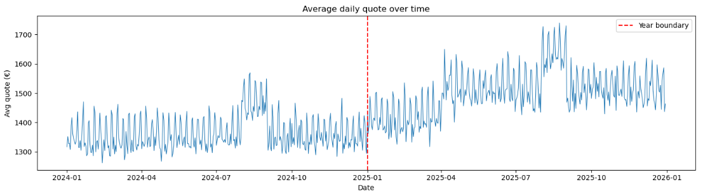
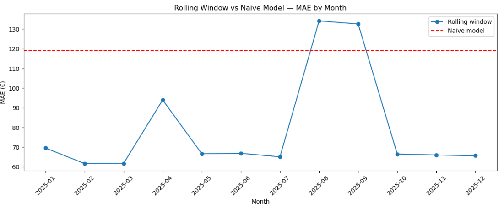
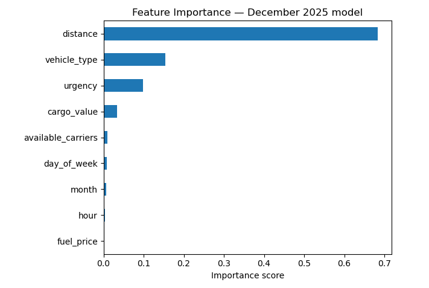

# Freight Quote Prediction — Concept Drift Case Study

A synthetic dataset and XGBoost model simulating how ML pricing models break in production — and how to fix it.

## The Problem

In dynamic industries like freight logistics, market conditions shift constantly (fuel prices, seasonality, carrier availability). A model trained on historical data gradually becomes stale — a problem known as **concept drift**.

This project simulates that scenario and compares two approaches:
- **Naive model** — train once on year 1, predict year 2
- **Rolling window model** — retrain every month using the last 6 months of data

## Dataset

~1.5M synthetic freight shipments across 2 years (2024–2025), with a fuel price crisis built in halfway through (€1.40 → €1.85/L). Each row represents one shipment with the following features:

| Feature | Description |
|---|---|
| distance | Shipment distance in km (50–2500) |
| urgency | 0 = standard, 1 = next day, 2 = same day |
| vehicle_type | 0 = van, 1 = small truck, 2 = large truck |
| available_carriers | Number of carriers available at time of booking |
| fuel_price | Daily fuel price in €/L |
| cargo_value | Value of goods being shipped in € |
| month / day_of_week / hour | Temporal features |

**Target:** `quote` — the price charged to the shipper in €

## Results

| Model | MAE |
|---|---|
| Naive (train 2024, test 2025) | €119 |
| Rolling window (6-month window) | ~€65 |

The rolling window is **45% more accurate** by staying current with recent market conditions.

To make it concrete: the same shipment returns a **€1,577 quote** from the naive model and **€1,708** from the rolling one. That €131 gap is the cost of stale training data.

## Key Finding

Distance dominates feature importance (~70%), which makes intuitive sense for freight pricing. Fuel price scores near zero — not because it's irrelevant, but because the rolling window already absorbs its effect implicitly through recent training data.

## How to Run

```bash
pip install pandas numpy xgboost scikit-learn matplotlib
jupyter notebook freight_pricing.ipynb
```

## Stack
Python · XGBoost · pandas · scikit-learn · matplotlib

## Sample images




